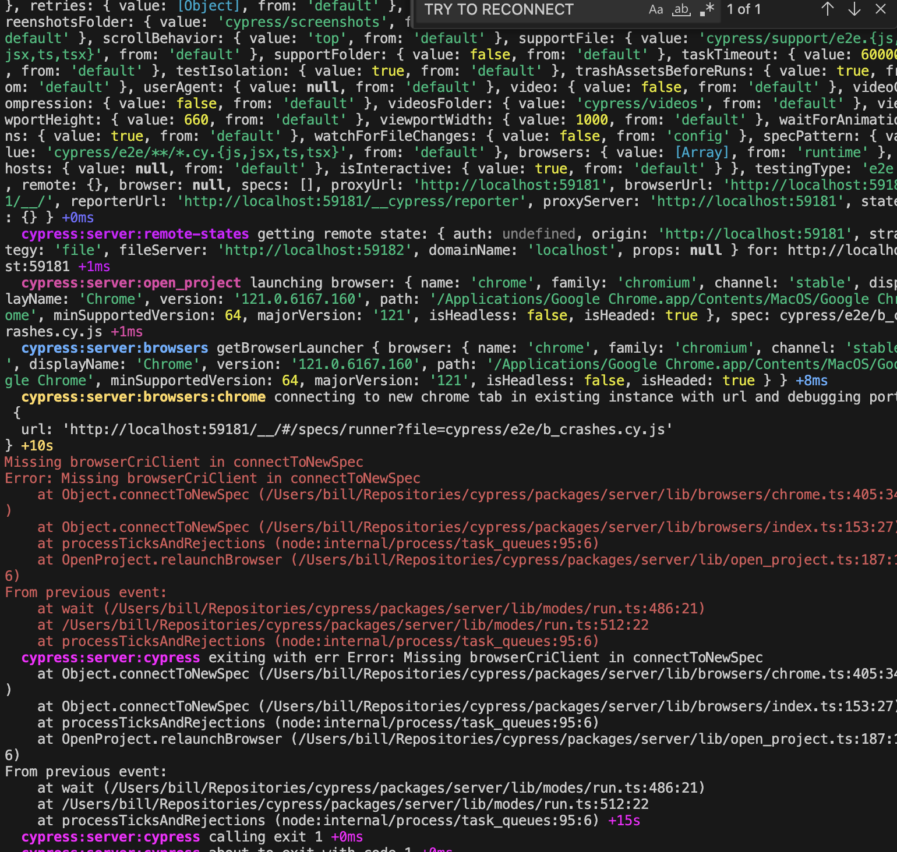

running cypress locally off this branch [reprod_browser_cri_crash_chrome](https://github.com/cypress-io/cypress/compare/reprod_browser_cri_crash_chrome), run the following:

```zsh
DEBUG=cypress:server*,-cypress:server:util:process_profiler yarn cypress:run --project=/Users/bill/Repositories/crash_test --headed --browser=chrome
```

should reproduce this 

ignore the spec names they are out of date. whats important is the wait in the first test